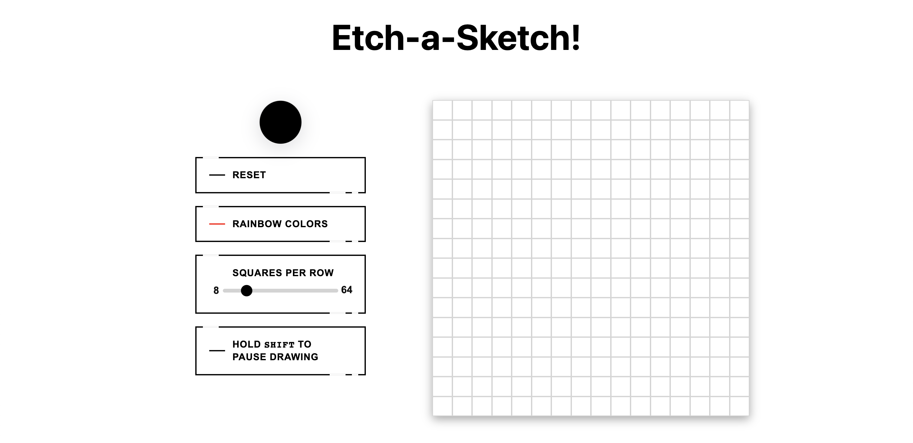

# odin-etch-a-sketch
The Odin Project: Projects - Etch-a-Sketch

Learning Outcomes:
1. Learn more about DOM manipulation
2. Learn more about color input and slider input

Update (08 / 24 / 22):
1. Learn more about button styling and responsiveness through pseudo-elements
2. Improve overall compactness of layout

Before:

After:
